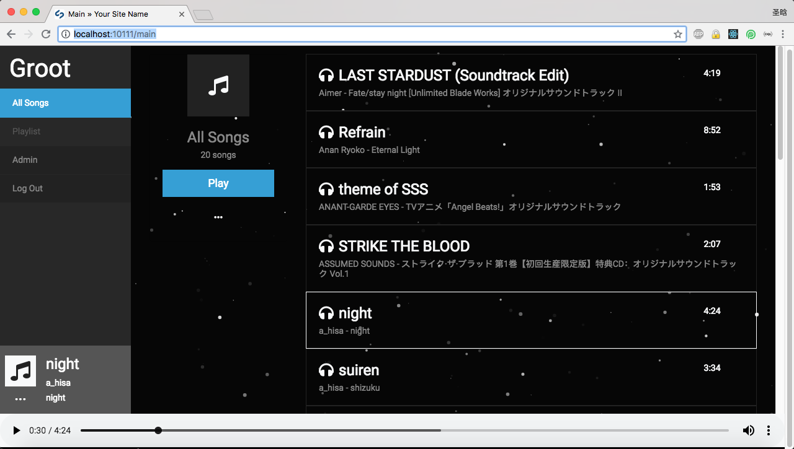

# ReadMe

> Notice: This is still a project under WIP stage, but welcome to use it anyway :)

## Screenshot

### Web Player



### Admin

#### Add a song

You can choose to extrat information included in the mp3 file.


#### Batch upload

After a batch upload job is created, the program will start to extract information from mp3 files under background. You may refresh the page to see the progress.


## Development & Deployment

### Tech stack

- Backend: Silverstripe 4
- API: GraphQL + Apollo
- Web: React + Redux

### Deploy on AWS EC2

1. Install Docker: https://docs.docker.com/install/linux/docker-ce/ubuntu/
2. Clone the repo:
```bash
$ git clone git@github.com:zzdjk6/Groot.git
$ cd Groot
```
3. Start a container to run in a web server (PHP + Apache included)
```bash
$ sudo docker run \
--rm \
--name groot-demo \
-p 80:80 \
-v "$PWD":/var/www/html \
-d brettt89/silverstripe-web:7.1-alpine

$ sudo docker exec -it groot-demo /bin/bash

groot-demo: /var/www/html>$ php ./composer.phar install

groot-demo: /var/www/html>$ exit
```
4. Setup a MySQL database (another Docker container or RDS)
5. Create the `.env` file like this:
```
SS_BASE_URL="http://<YOUR DOMAIN OR IP>:80/public" # you need to keep "/public" for now
SS_DATABASE_CLASS="MySQLPDODatabase"
SS_DATABASE_SERVER="<DB SERVER>"
SS_DATABASE_USERNAME="<DB USER NAME>"
SS_DATABASE_PASSWORD="<DB PASSWORD>"
SS_DATABASE_NAME="<DB NAME>"
SS_ENVIRONMENT_TYPE="dev"
SS_DEFAULT_ADMIN_USERNAME="admin" # your admin username
SS_DEFAULT_ADMIN_PASSWORD="admin" # your admin password

# Blow can be igonred for now
#JWT_PREFIX=<YOUR_PREFIX>
#JWT_SIGNER_KEY=<YOUR_SIGNER_KEY>
```
6. Open browser and navigate to `http://<YOUR DOMAIN OR IP>:80/dev/build?flush=1` to init the database tables and cache configs
7. Navigate to `http://<YOUR DOMAIN OR IP>:80/main` and enjoy!