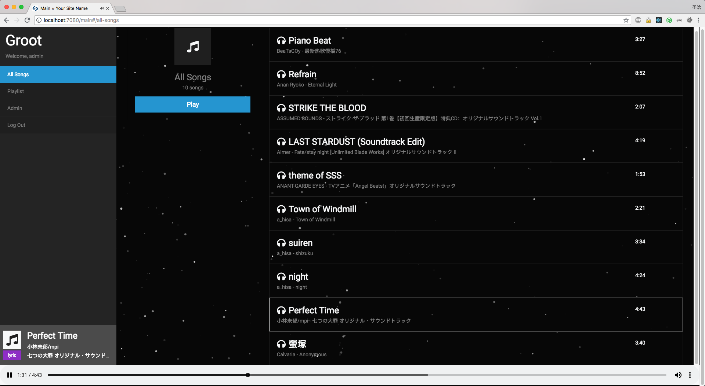
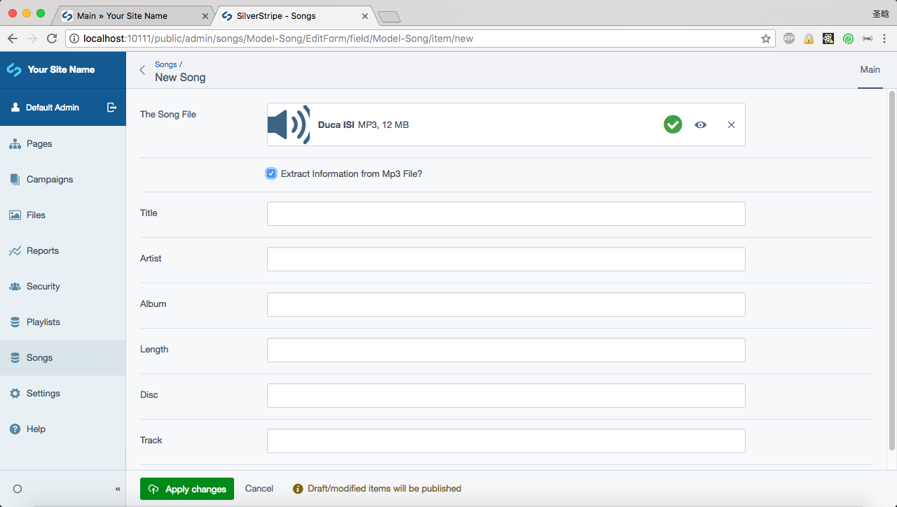
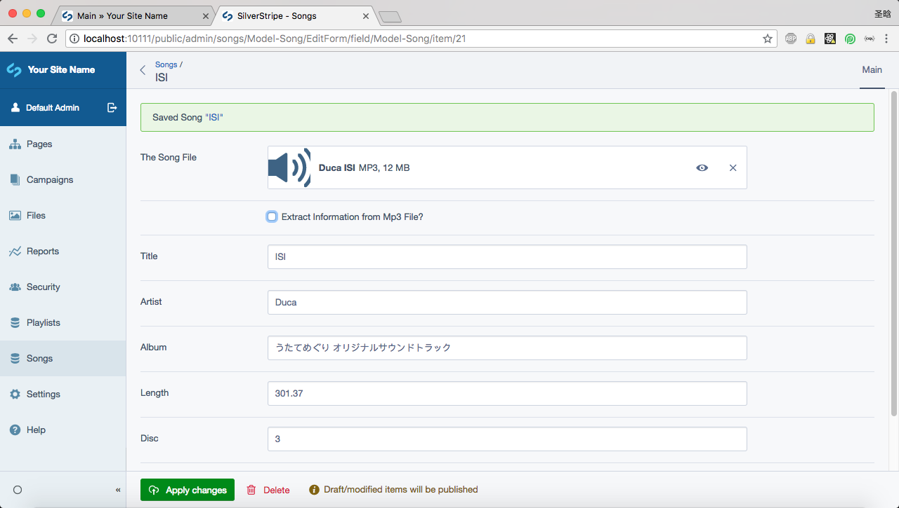
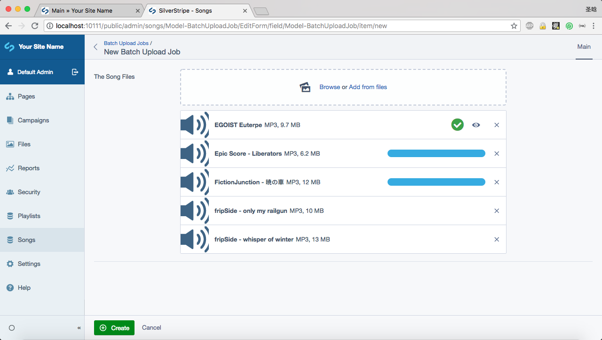
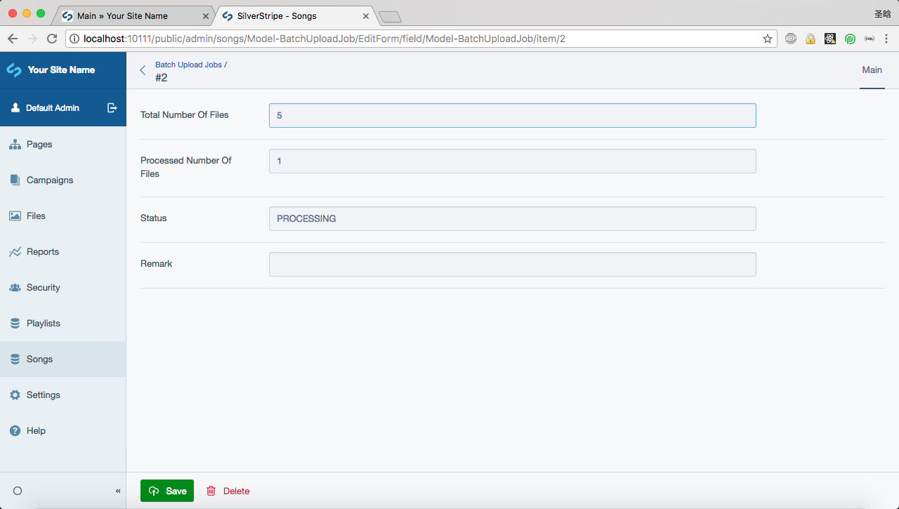
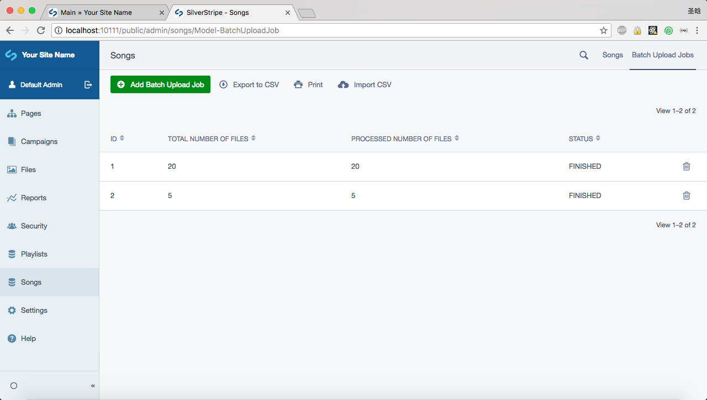

# Readme

`Groot` is a software that hosts and serves your music files on the cloud just like other online music services, but allow you to build a self-hosted platform.

## Why I build it?

I encountered two problems in my life:

1. My favorite online music service stopped serving me because I am oversea (IP issues: they limit the service according to my IP address due to `Intellectual Property` reason).
2. The online service platform removes songs now and then. After I add some music into my playlist, it becomes unavailable after several months.

These two problems stop me from enjoying music online. But I enjoy the experience when there is an online platform, so I decided to build one by myself. If you are under the same situation, this project is for you too :)

By the way, this is a side project to practice some new skills that may be required by my next job, so I didn't choose some of the mainstream techniques that I am already familiar with. 

> Notice: This is still a project under WIP stage, but welcome to use it anyway :)

## Screenshot

### Web Player



### Admin

#### Add a song

You can choose to extract information included in the mp3 file.





#### Batch upload

After a batch upload job is created, the program will start to extract information from mp3 files under background. You may refresh the page to see the progress.







## Development & Deployment

### Tech stack

- Backend: SilverStripe 4
- API: GraphQL
- Web: React + Redux + Bootstrap 4

### Deploy with Docker

#### 1. Install Docker

see: [https://docs.docker.com/install/linux/docker-ce/ubuntu/](https://docs.docker.com/install/linux/docker-ce/ubuntu/)

#### 2. Setup a MySQL instance (either set it locally or use AWS RDS or other services)

#### 3. Clone the repo

```bash
$ git clone git@github.com:zzdjk6/Groot.git
$ cd Groot
```

#### 4. Build and run Docker container (Nginx + PHP-FPM 7.2)

> you can choose your port instead of sticking to 80

```bash
$ sudo docker build -t groot-build ./dockerfile/ 

$ sudo docker run \
-it \
--rm \
-d \
-p 80:80 \
-v "$PWD":/var/www/project:delegated \
--name groot-build  \
groot-build /bin/bash

$ sudo docker exec -it groot-build /bin/bash
```
#### 5. Setup environment and install dependencies

```bash
$ cd /var/www/project

$ php ./composer.phar install

$ cp ./.env.example ./.env

$ nano .env
```

#### 6. Fix permission issues

```bash
$ chown -R www-data ./ 

$ chgrp -R www-data ./ 

$ chmod -R 777 ./
```

#### 7. Run services

```bash
$ service nginx start

$ service php7.2-fpm start
```

#### 8. Build database schema and tables

Open browser and navigate to `http://<your ip or domain name>:<your port>/dev/build?flush=1`

#### 9. Enjoy

Navigate to `http://<your ip or domain name>:<your port>/main` and enjoy!

### Deploy manually

1. Check server requirements by visiting `http://<your ip or domain name>:<your port>/install.php`
2. A template Nginx config file can be found in [https://docs.silverstripe.org/en/4/getting_started/installation/how_to/configure_nginx](https://docs.silverstripe.org/en/4/getting_started/installation/how_to/configure_nginx).
3. If you want to use Apache, be sure to let it pass `Authorization` correctly. See [https://github.com/Firesphere/silverstripe-graphql-jwt/issues/15](https://github.com/Firesphere/silverstripe-graphql-jwt/issues/15).